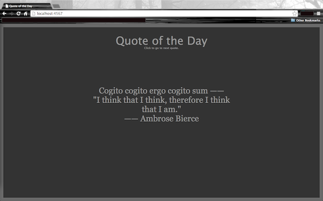

# Qotd ~ Quote of the Day

**Displays a random formatted quote from a massive compilation of hilarious quotes.**
The output is either formatted in a terminal to always be spaced out to the 80th column, and the quote displayed with reversed foreground / background colors, or displayed in your browser with a Sinatra application on `localhost:4567`.

A big thanks to [textfiles.com](textfiles.com), where I got all the quotes. Without it, there would be no quote of the day. The reformatted file with all the quotes in it numbers over 3000 lines!

## Installation

Add this line to your application's Gemfile:

    gem 'qotd'

And then execute:

    $ bundle

Or install it yourself as:

    $ gem install qotd

## Usage

### For output to the terminal:

*A random quote at login.*

    # ~/.bashrc
    # ...
    # Random quote.
    qotd

*A formatted motd replacement.*

    # ~/.bashrc
    # ...
    # Custom message.
    qotd "Hello Master"

*At the command prompt.*

    # Random quote.
    $ qotd

    # Custom message.
    $ qotd "Quote of the Day"

### For the Sinatra application.

Sometimes, if you want to see multiple quotes, it can be repetitive to constantly re-run the qotd command.
Now, you can use a simple Sinatra application, viewed by your browser at [http://localhost:4567](http://localhost:4567), to take in the *wisdom* provided by a compilation of hilarious quotes.
The CSS styling is arguably better than what is possible with ASCII color escape codes (`\033[7m`, for example).

    # Open browser at `http://localhost:4567` and
    # run the Qweb Sinatra application.
    $ qotd --web  # <CTRL-C> to stop serving on localhost and exit.

*Please note that you may have to refresh your browser once it is opened to view quotes. The only way to open the browser is before the sinatra application runs, and `localhost:4567` is not being served before runtime.*

#### To change the quote in the browser.

- Click to change the quote.
- If you are so hopelessly lazy to even to that, the quote will automatically change every minute.

## Contributing

1. Fork it ( http://github.com/jfjhh/qotd/fork )
2. Create your feature branch (`git checkout -b my-new-feature`)
3. Commit your changes (`git commit -am 'Add some feature'`)
4. Push to the branch (`git push origin my-new-feature`)
5. Create new Pull Request

